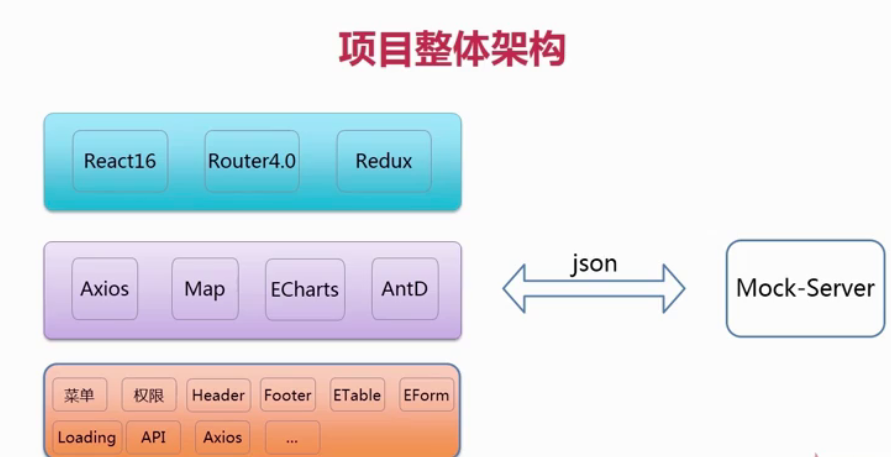

# 一、 项目整体架构

 
# 二、项目基础

## 2.1 React 脚手架

## 2.2 Yarn 
优点： 
- 速度快
- 安装版本统一、更安全，形成了 lock 文件
- 更简洁的输出
- 更好的语意话

如何使用 yarn    
- `yarn init` 初始化一个项目
- `yarn add` 安装一个包
- `yarn install` 或者 `yarn` 安装这个项目所有的依赖的所有的包

安装 react-router
- `yarn add react-router`

# 二、项目主页工程搭建    

## 2.1 基础插件安装，less 文件还在配置
- 安装 react-router `yarn add react-router` 
- 安装 axios `yarn add axios`
- 安装 AntD `yarn add antd`
- 暴露 webpack 配置文件，原因是 antD 使用了 less，但是使用react 脚手架没有配置 less，就需要暴露 webpack 然后安装 less-loader，配置 less-loader。后续可以通过设置 less 文件，更改 antD 组件的主题
 `yarn eject`  
    - 运行完以后， pack.json 里面多了很多配置，主要看安装的插件还在不在，主要看 "script" 里面的怎么构建（bilud），怎么运行（start），怎么打包。
    - 在项目目录里面出现了 config 文件，这个文件就是 webpack 的配置文件。在里面可以配置 less
        - `webpack-config-dev` 是开发的配置 
        - `webpack-config-prod` 是生产的配置
        - `webpackDevServer` 是本地服务器的配置，目的是通过 localhost 访问到前端项目
        目前我们需要关心的是：`webpack-config-dev` 和 `webpack-config-prod`，要保持这两个配置文件的一致性，否则上线的时候会出现问题
- 安装 less-loader `yarn add less-loader`  `yarn add less`      
    - 在 `webpack-config-dev` 里面找到 css 的配置项，吧整个哦诶只想复制，粘贴，将 css 换成 less，前提是必须安装过 less-loader，看是否安装了 less-loader 可以去 pack.json 文件中去查看
    - 在 less 配置项的末尾 配置 `{loader: require.resolve('less-loader')}` 因为 webpack 是从后向前解析的，先把 less 文件按照 less 的格式进行解析，然后在一层层的向上解析成 css 文件，再解析成行内样式的 css。  
    - 修改完配置以后，要复制到 prod 里面，否则上线的时候会报错。
    - 重启项目

## 2.2 项目主页结构开发

## 2.3 菜单组件开发    

## 2.4 头部组件的开发

## 2.5 底部组件的开发

# 三、 router 4.0 实战

# 四、Antd 常用 UI 组件之一

# 五、Antd 常用 UI 组件之二

# 六、Antd 常用 UI 组件之三

# 七、单车业务基本功能开发之一

# 八、单车业务基本功能开发之二

# 九、项目工程化开发   

# 十、单车业务核心模块开发之一     

# 十一、单车业务核心模块开发之二

# 十二、单车业务核心模块开发之三

# 十三、单车业务核心模块开发之四

# 十四、redux 集成

